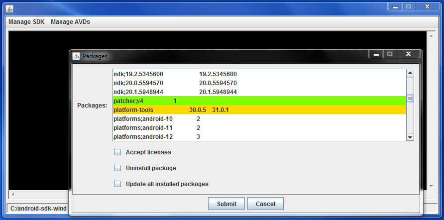

## A Manager for the Android SDK.  Wraps the Android SDK's 'sdkmanager', 'avdmanager' and 'emulator'.

# Features:

* Packages:
* List, install, uninstall and update packages.
* Option to choose Channel.

* AVDs:
* Create, list, start and delete AVDs.
* Many options to launch.

* After you check "Accept licenses" it will automatically
* accept them.

# Screenshots:

